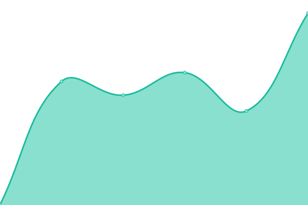

# [📈 Live Status](https://ggscores.github.io/esports-data-provider-status): <!--live status--> **🟩 All systems operational**

This repository contains the open-source uptime monitor and status page for [GG Scores](https://ggscores.com), powered by [Upptime](https://github.com/upptime/upptime).

With [Upptime](https://upptime.js.org), you can get your own unlimited and free uptime monitor and status page, powered entirely by a GitHub repository. We use [Issues](https://github.com/ggscores/esports-data-provider-status/issues) as incident reports, [Actions](https://github.com/ggscores/esports-data-provider-status/actions) as uptime monitors, and [Pages](https://ggscores.github.io/esports-data-provider-status) for the status page.

<!--start: status pages-->
<!-- This summary is generated by Upptime (https://github.com/upptime/upptime) -->
<!-- Do not edit this manually, your changes will be overwritten -->
<!-- prettier-ignore -->
| URL | Status | History | Response Time | Uptime |
| --- | ------ | ------- | ------------- | ------ |
|  [APIV3-Teams](https://apiv3.esports-data-provider.com/teams) | 🟩 Up | [apiv-3-teams.yml](https://github.com/ggscores/esports-data-provider-status/commits/HEAD/history/apiv-3-teams.yml) | 

 422ms
     
 | 

<a href="https://ggscores.github.io/esports-data-provider-status/history/apiv-3-teams">100.00%</a>
    

|  [APIV3-Events](https://apiv3.esports-data-provider.com/events) | 🟩 Up | [apiv-3-events.yml](https://github.com/ggscores/esports-data-provider-status/commits/HEAD/history/apiv-3-events.yml) | 

 155ms
     
 | 

<a href="https://ggscores.github.io/esports-data-provider-status/history/apiv-3-events">100.00%</a>
    

|  [APIV3-Matches](https://apiv3.esports-data-provider.com/matches) | 🟩 Up | [apiv-3-matches.yml](https://github.com/ggscores/esports-data-provider-status/commits/HEAD/history/apiv-3-matches.yml) | 

 80ms
     
 | 

<a href="https://ggscores.github.io/esports-data-provider-status/history/apiv-3-matches">100.00%</a>
    

|  [APIV3-VideoGames](https://apiv3.esports-data-provider.com/videogames) | 🟩 Up | [apiv-3-video-games.yml](https://github.com/ggscores/esports-data-provider-status/commits/HEAD/history/apiv-3-video-games.yml) | 

 81ms
     
 | 

<a href="https://ggscores.github.io/esports-data-provider-status/history/apiv-3-video-games">100.00%</a>
    

<!--end: status pages-->

[**Visit our status website →**](https://ggscores.github.io/esports-data-provider-status)

## 📄 License

- Powered by: [Upptime](https://github.com/upptime/upptime)
- Code: [MIT](./LICENSE) © [GG Scores](https://ggscores.com)
- Data in the `./history` directory: [Open Database License](https://opendatacommons.org/licenses/odbl/1-0/)
